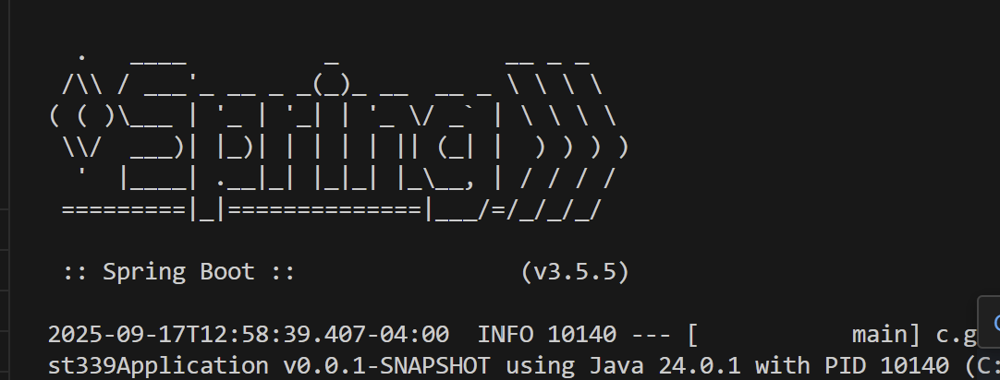
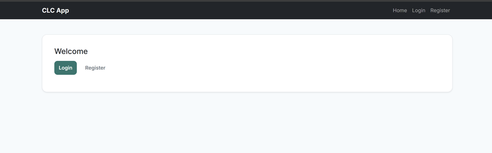
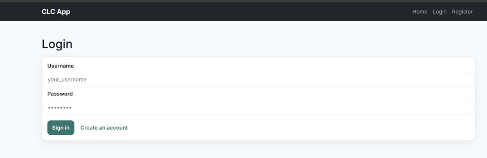
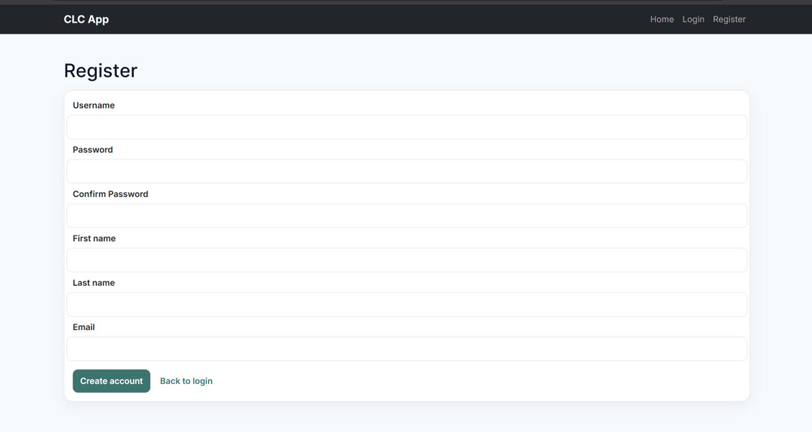
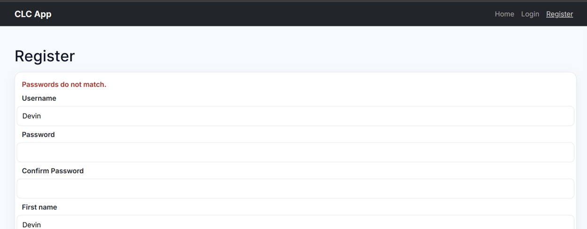

**Name:Devin Puckett**  
**Course:Cst-339**  
**Date:09/17/2025** 

**Professor:Bobby Estey**

---

## 1)  Showing SpringBoot Active on Successful Build 

Terminal showing a successful build with SpringBoot Logo
---

## 2) Shows Home Page

  This is the welcome page for my CLC app. The dark top bar shows the app name on the left and simple links on the right for Home, Login, and Register. In the center, there’s a clean rounded card that says Welcome with two clear options. The Login button stands out and the Register link sits right next to it, so returning users can sign in fast and new users know where to start. The spacing is open and not cluttered, which keeps the focus on those two actions. This is the first screen people see before jumping into the rest of the app.
---

## 3) Shows Updated Login Page

  Here’s the login screen for my CLC app, with a simple top bar that shows Home, Login, and Register. The page is clean and centered, with a bold Login title and a rounded card that looks neat. I added placeholders so it’s clear where to type the username and password, and the password field hides what you type. The main action is the Sign in button, and there’s a Create an account link for new users. Overall, it feels straightforward and easy to follow, which is exactly what I wanted for this step.---
---

## 4) Shows Updated Register Page

  This is the register screen for my CLC app. It has a clean form with fields for username, password, confirm password, first name, last name, and email. The layout is centered inside a rounded card and everything lines up neatly. The main action is the Create account button, and there’s a Back to login link right next to it so users can switch if they already have an account. I like that it’s simple and clear, so new users know exactly what to fill out.
---

## 5) Showing Registration Error

  This screen is telling me the two password fields don’t match. The app compares Password and Confirm Password exactly, so even one extra space, a different letter case, or a small typo will trigger this message. The nice part is the rest of the form stays filled in, so I only need to fix the password fields. I should retype both passwords slowly and make sure they’re identical. If caps lock is on or I pasted one of them, I’ll double-check that too. Once they match, the red error goes away and I can create the account.
---

## 5) Same Layout

  This screenshot highlights the consistent navigation bar that appears across all pages of the CLC application. Using a Thymeleaf fragment, the navbar provides links to Home, Products, and Logout, ensuring a uniform user experience throughout the site. The success alert “Product deleted.” is also displayed, showing feedback when a product is removed. By centralizing the navbar into a shared template, any updates to navigation automatically apply across every page, reinforcing both consistency and maintainability in the application’s design.
---

## - Conclusion
  For this milestone, I built a clean, simple CLC app shell with a dark top bar and centered cards so every screen feels the same. I added the welcome page plus the login and register pages, and kept the inputs clear with labels and placeholders so it is obvious what to do. Form validation is working, like the “passwords do not match” message that shows up in red and keeps the other fields in place. I focused on a basic, friendly flow where returning users can sign in fast and new users can create an account without confusion. I also organized the project and pushed it to GitHub, so the code is backed up and easy to share. Next will be the next upgrade and to continue building out the rest of the app features. Overall, this milestone provided me with a solid and consistent foundation to build upon.
  ---
